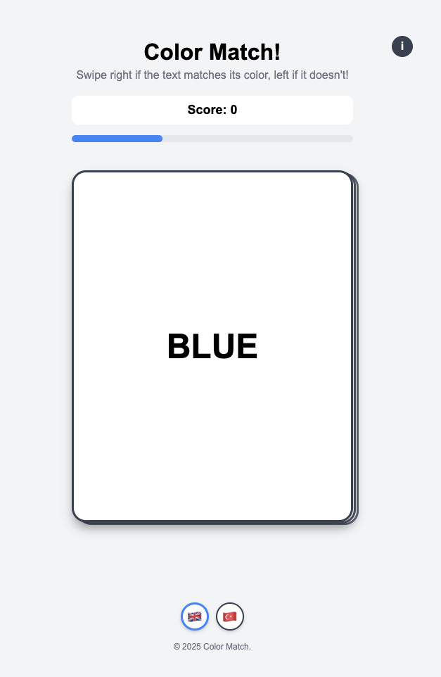

# Color Match

A fast-paced, mobile-friendly web game where players must quickly identify whether a color name matches the actual color it's displayed in.

[Play Now!](https://colormatched.netlify.app)

## Overview

Color Match is a reaction-based game inspired by the psychological Stroop effect. Players must swipe right when the displayed text matches its color (e.g., "RED" written in red color), and swipe left when they don't match (e.g., "RED" written in blue color).
Each correct answer adds time to the countdown, with faster responses earning more time. Incorrect responses subtract time, creating an engaging challenge that tests both speed and accuracy.

## How To Play

- Swipe right if the color name matches its text color
- Swipe left if the color name doesn't match its text color
- React quickly to earn more time bonus
- Try to achieve the highest score possible before time runs out

## Preview

## License

This project is licensed under the MIT License - see the [LICENSE](LICENSE) file for details.

## Acknowledgments

- Inspired by the Lumosity
